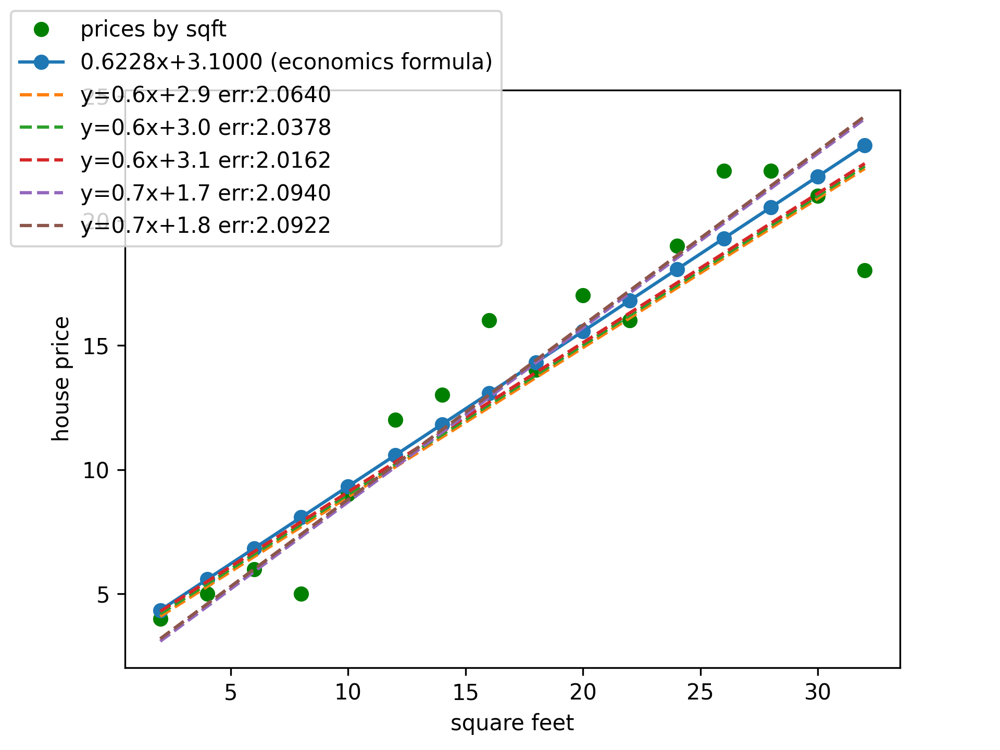

#example solution for ann-ml lectures
###simple regression analysis
- simple_linear_regression_example_ANN.py
  - [x] Very basic solution as brute forcing all possible models.
  	1. brute force all possible solutions.
  	2. compare RSS of solution models.
  	3. print top #(5) solutions.
  - _We can compare models with approved solution formula of field of statistics/economics seen on graph._
  
  ***
