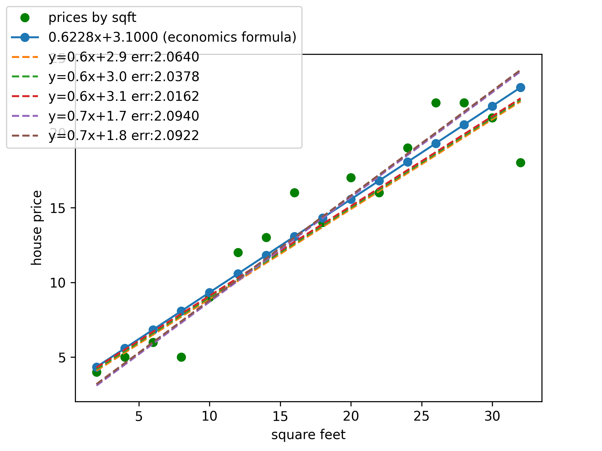

#example solution for ann-ml lectures
###simple regression analysis
- simple_linear_regression_example_ANN.py
  - [x] Very basic solution as brute forcing all possible models.
  	1. brute force all possible solutions.
  	2. compare RSS of solution models.
  	3. print top #(5) solutions.
  - _We can compare models with approved solution formula of field of statistics/economics seen on graph._
  
  ***
- haloLearn.py
  - [x] a simple algorithm for prediction problem. Can be improved by comparing two functions on a step, thus reduce functions that exceed turning points.
    1. determine coefficient(mean slope) of dots ( SUM(y)/SUM(x) )
    2. determine a stepsize that how long it re-predict
      3. on every re-prediction, determine mean constant value by coefficient (b=y- ax)
      4. calculate RSS by estimated function values.
      5. if estimated RSS is better than RSS before; continue in this direction.
      6. if not; change direction to revert and decrease precision to get closer to better model.
  - We see how function works by plotting steps on figure. And compare with statistics formula.
  
